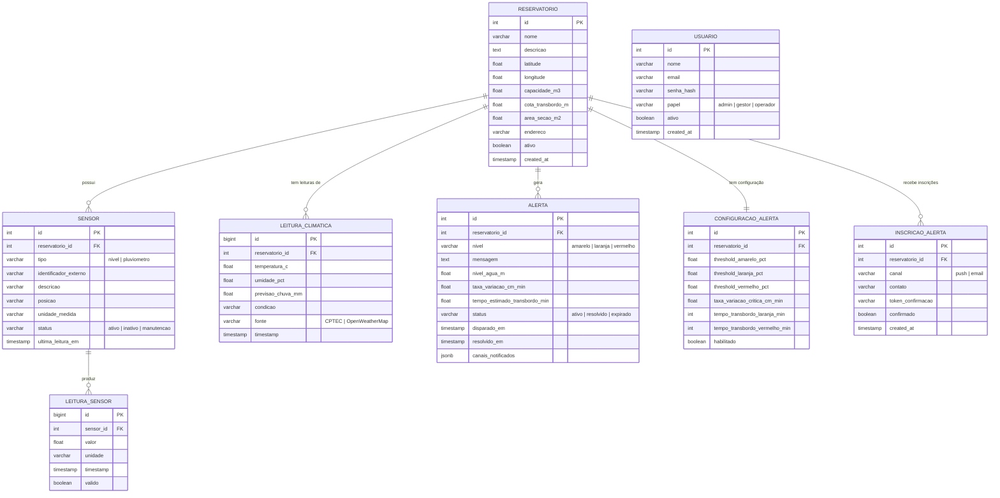

# Sistema de Monitoramento de Piscinões — SRS

## Software Requirements Specification (SRS)

**Projeto:** PJI510 — Projeto Integrador em Engenharia da Computação  
**Instituição:** UNIVESP — Universidade Virtual do Estado de São Paulo  
**Versão:** 1.0  
**Data:** 05/05/2026  
**Status:** Em Desenvolvimento  
**Base documental:** 001 - Plano de Desenvolvimento | 004 - DevSpecs  

---

## Sumário

1. [Introdução](#1-introdução)
2. [Visão Geral do Sistema](#2-visão-geral-do-sistema)
3. [Personas e Atores](#3-personas-e-atores)
4. [Requisitos Funcionais](#4-requisitos-funcionais)
5. [Requisitos Não-Funcionais](#5-requisitos-não-funcionais)
6. [User Stories](#6-user-stories)
7. [Regras de Negócio](#7-regras-de-negócio)
8. [Modelo Entidade-Relacionamento](#8-modelo-entidade-relacionamento)
9. [Diagrama de Casos de Uso](#9-diagrama-de-casos-de-uso)
10. [Glossário Ubíquo](#10-glossário-ubíquo)

---

## 1. Introdução

### 1.1 Propósito

Este documento especifica os requisitos funcionais e não-funcionais do **Sistema de Monitoramento de Piscinões (Pôlders) com IoT**, doravante denominado **PiscinãoMonitor**. O objetivo é estabelecer um contrato claro entre as necessidades do problema e a solução técnica a ser implementada, servindo de referência para o desenvolvimento, testes e avaliação acadêmica do sistema.

O sistema tem como objetivo fornecer:

- Monitoramento em tempo real do nível d'água de reservatórios de detenção (piscinões) via sensores IoT
- Processamento automático de dados para cálculo de volume, taxa de variação e estimativa de transbordo
- Alertas hierárquicos (Normal / Atenção / Alerta / Emergência) disparados de forma proativa e automática
- Dashboards de visualização: técnico (para gestores e Defesa Civil) e público (para a população)
- Notificações multicanal (Web Push e email) com inscrição voluntária de cidadãos

### 1.2 Escopo do Sistema

O sistema permitirá:

- Receber leituras de sensores IoT (nível d'água e pluviômetro) via endpoint REST que abstrai o broker MQTT
- Persistir séries temporais de leituras em banco de dados otimizado (TimescaleDB)
- Calcular automaticamente volume, taxa de variação e estimativa de tempo para transbordo
- Disparar alertas multicanal quando thresholds configuráveis são atingidos
- Exibir um dashboard técnico com gráficos, mapa interativo e histórico completo para gestores
- Exibir um dashboard público com semáforo de risco em linguagem acessível para a população
- Integrar dados de APIs climáticas públicas (CPTEC/INPE e OpenWeatherMap) para correlação com pluviometria
- Operar como Progressive Web App (PWA) com suporte a funcionamento offline e push notifications

O sistema **não** contemplará (no MVP):

- Aplicativo mobile nativo (iOS/Android)
- Integração direta com sistemas da Defesa Civil / CEMADEN
- Modelos hidrológicos complexos (Manning, Saint-Venant)
- Envio de alertas via SMS e WhatsApp (adapters previstos para fase futura)
- Monitoramento de câmeras / CFTV

O sistema será acessado via **aplicação web responsiva (SPA)** e instalável como **PWA**, servida pelo NGINX e funcionando em qualquer navegador moderno.

### 1.3 Definições e Abreviações

| Termo | Definição |
|-------|-----------|
| **Piscinão** | Reservatório de detenção hidráulica construído para reter temporariamente o excesso de água pluvial em áreas urbanas, reduzindo picos de vazão em córregos e rios |
| **Pôlder** | Sinônimo técnico de piscinão; estrutura hidráulica de detenção com controle de nível |
| **Cota de transbordo** | Nível máximo de água que o reservatório suporta antes de transbordar (metros) |
| **Taxa de variação** | Velocidade de variação do nível d'água (Δh/Δt), expressa em cm/min |
| **Threshold** | Valor limite configurável que, quando atingido, dispara uma ação no sistema (ex.: nível de alerta) |
| **MQTT** | Message Queuing Telemetry Transport — protocolo leve de mensageria para IoT, baseado em publish/subscribe |
| **Hypertable** | Tabela especial do TimescaleDB particionada automaticamente por tempo para otimizar séries temporais |
| **Continuous Aggregate** | View materializada do TimescaleDB que pré-computa agregações de séries temporais (ex.: médias horárias) |
| **IoT** | Internet of Things — conjunto de dispositivos físicos (sensores, atuadores) conectados à internet |
| **PWA** | Progressive Web App — aplicação web instalável com suporte offline e push notifications |
| **VAPID** | Voluntary Application Server Identification — protocolo para autenticação de servidores em Web Push |
| **JWT** | JSON Web Token — padrão para autenticação stateless via tokens assinados digitalmente |
| **RBAC** | Role-Based Access Control — controle de acesso baseado em papéis (admin, gestor, operador) |
| **WebSocket** | Protocolo de comunicação bidirecional persistente sobre TCP, usado para atualizações em tempo real |
| **SPA** | Single Page Application — aplicação frontend que opera como página única, sem recarregamentos completos |
| **TimescaleDB** | Extensão do PostgreSQL otimizada para séries temporais, com hypertables e compressão automática |
| **ARQ** | Biblioteca Python async-native para processamento de filas de tarefas com Redis como broker |
| **CPTEC/INPE** | Centro de Previsão de Tempo e Estudos Climáticos / Instituto Nacional de Pesquisas Espaciais |
| **CEMADEN** | Centro Nacional de Monitoramento e Alertas de Desastres Naturais |
| **DAEE-SP** | Departamento de Águas e Energia Elétrica do Estado de São Paulo |

---

## 2. Visão Geral do Sistema

### 2.1 Usuários do Sistema

| Tipo de Usuário | Descrição | Acesso |
|-----------------|-----------|--------|
| **Cidadão** | Morador do entorno de um piscinão; acessa o dashboard público para verificar status de risco e se inscreve para receber alertas | Sem autenticação (dashboard público) |
| **Gestor / Defesa Civil** | Técnico ou agente da Defesa Civil responsável por monitorar reservatórios; acessa o dashboard técnico com dados completos e histórico | Autenticação JWT (papel: gestor) |
| **Administrador** | Responsável pela configuração do sistema: cadastro de reservatórios, sensores e thresholds de alerta | Autenticação JWT (papel: admin) |

### 2.2 Arquitetura Geral

O sistema adota uma **arquitetura de monolito modular** com separação por domínios de negócio, executada em containers Docker.

```text
┌──────────────────────────────────────────────────────────┐
│                    Usuários / Dispositivos                │
│   Cidadão (browser/PWA)  Gestor (browser)  Sensores IoT  │
└────────────────┬─────────────────┬──────────────┬─────────┘
                 │                 │              │
                 ▼                 ▼              ▼
┌──────────────────────────────────────────────────────────┐
│             NGINX (Reverse Proxy / Static Server)         │
│   :80/:443 → Static React SPA + Proxy /api/* + WS /ws/*  │
└──────────────────────────┬───────────────────────────────┘
                           │
                           ▼
┌──────────────────────────────────────────────────────────┐
│                   Backend FastAPI (Python 3.12)           │
│  ┌────────────┐ ┌─────────────┐ ┌────────┐ ┌──────────┐  │
│  │  Ingestão  │ │Processamento│ │Alertas │ │Dashboard │  │
│  └────────────┘ └─────────────┘ └────────┘ └──────────┘  │
│  ┌────────────┐ ┌─────────────┐ ┌────────────────────┐   │
│  │   Clima    │ │     Auth    │ │   Core (Middleware) │   │
│  └────────────┘ └─────────────┘ └────────────────────┘   │
└──────────┬──────────────────────────────────┬────────────┘
           │                                  │
           ▼                                  ▼
┌─────────────────────┐            ┌─────────────────────┐
│  PostgreSQL 16      │            │      Redis 7         │
│  + TimescaleDB 2.x  │            │  Cache + Pub/Sub     │
│  (hypertables)      │            │  + Broker ARQ        │
└─────────────────────┘            └─────────────────────┘
                                            │
                                            ▼
                                  ┌─────────────────────┐
                                  │    ARQ Worker        │
                                  │  (Dispatch alertas:  │
                                  │   Push, Email)       │
                                  └─────────────────────┘
```

---

## 3. Personas e Atores

### 3.1 Cidadão

**Perfil:** Morador do entorno de um piscinão na região metropolitana de São Paulo, com qualquer nível de familiaridade tecnológica. Possui smartphone com acesso à internet.

**Motivação:** Quer saber, de forma rápida e clara, se existe risco de enchente no seu bairro — sem precisar interpretar dados técnicos.

**Cenário de uso:** Durante um dia de chuva forte, o Cidadão acessa o dashboard público pelo celular e visualiza o semáforo vermelho para o piscinão do seu bairro. Ele recebe uma notificação push (por ter se inscrito previamente) informando que o nível atingiu 90% da capacidade. Com a informação em mãos, ele toma uma decisão de segurança.

**Necessidades principais:**
- Visualização imediata do status de risco (semáforo)
- Linguagem acessível, sem jargões técnicos
- Notificações proativas no celular
- Funcionamento offline para última leitura conhecida

---

### 3.2 Gestor / Defesa Civil

**Perfil:** Técnico ou coordenador de Defesa Civil, familiarizado com dados hidrológicos e procedimentos de emergência. Acessa o sistema de uma estação de trabalho ou notebook.

**Motivação:** Precisa monitorar múltiplos reservatórios simultaneamente, acompanhar tendências e tomar decisões de acionamento de equipes com base em dados confiáveis e atualizados.

**Cenário de uso:** Durante um evento de chuva, o Gestor monitora o dashboard técnico em tempo real. Ele observa que o nível de um piscinão está subindo a 3 cm/min e a estimativa de transbordo é 45 minutos. Com isso, aciona preventivamente a equipe de campo antes que o alerta vermelho seja atingido.

**Necessidades principais:**
- Gráficos de séries temporais atualizados em tempo real
- Indicadores calculados: taxa de variação, estimativa de transbordo, percentual de capacidade
- Mapa com status visual de todos os reservatórios
- Histórico de alertas e leituras para análise retrospectiva
- Acesso a dados climáticos correlacionados

---

### 3.3 Administrador

**Perfil:** Responsável técnico pelo sistema (equipe de TI ou operações). Configura e mantém o sistema operacional.

**Motivação:** Garantir que os sensores estejam ativos, os thresholds estejam calibrados para cada reservatório e o sistema funcione sem interrupções.

**Cenário de uso:** O Administrador cadastra um novo piscinão no sistema após a instalação dos sensores. Define as cotas de alerta (amarelo em 60%, laranja em 80%, vermelho em 90%) e verifica no painel de sensores que ambos os sensores de nível estão enviando leituras válidas.

**Necessidades principais:**
- Cadastro e gerenciamento de reservatórios e sensores
- Configuração de thresholds de alerta por reservatório
- Monitoramento de status e saúde dos sensores
- Visualização de logs e auditoria do sistema

---

## 4. Requisitos Funcionais

### Módulo 1 — Ingestão de Dados IoT

**`RF01 — Recebimento de Leituras em Batch`**

O sistema deve expor um endpoint REST autenticado por API Key que receba, em um único request, um lote de leituras de sensores provenientes do gateway IoT.

Campos do payload:
- `gateway_id`: identificador do gateway de origem
- `timestamp`: data/hora ISO 8601 da coleta
- `leituras[]`: array com `sensor_id`, `tipo` (nivel | pluviometro), `valor`, `unidade`

**`RF02 — Validação de Payload`**

O sistema deve validar estruturalmente cada leitura recebida (tipos corretos, campos obrigatórios, ranges físicos plausíveis). Leituras com dados malformados devem ser rejeitadas com HTTP 422 e registro de log, sem prejudicar as leituras válidas do mesmo batch.

**`RF03 — Autenticação do Gateway por API Key`**

O endpoint de ingestão deve exigir autenticação via API Key no header `X-API-Key`. Requisições sem chave válida devem retornar HTTP 401. A chave deve ser configurada por variável de ambiente.

**`RF04 — Persistência em Séries Temporais`**

Cada leitura válida deve ser persistida na hypertable `leitura_sensor` do TimescaleDB com o timestamp original da coleta (não o timestamp de chegada ao servidor), garantindo a integridade da série histórica.

**`RF05 — Rate Limiting no Endpoint de Ingestão`**

O sistema deve aplicar rate limiting específico no endpoint de ingestão (10 req/s com burst de 20) para proteção contra sobrecarga e injeção de dados maliciosos.

---

### Módulo 2 — Processamento e Regras de Negócio

**`RF06 — Cálculo de Volume Atual`**

A cada nova leitura de nível, o sistema deve calcular automaticamente o volume atual de água no reservatório com base na geometria cadastrada, e o percentual em relação à capacidade máxima.

**`RF07 — Cálculo de Taxa de Variação`**

O sistema deve calcular a taxa de variação do nível (Δh/Δt em cm/min) utilizando as últimas leituras válidas do reservatório, indicando se o nível está subindo, estável ou descendo.

**`RF08 — Estimativa de Tempo para Transbordo`**

Quando a taxa de variação for positiva (nível subindo), o sistema deve calcular a estimativa de tempo para atingir a cota de transbordo. Quando a taxa for zero ou negativa, o campo deve ser exibido como "N/A".

**`RF09 — Redundância de Sensores de Nível`**

O sistema deve combinar as leituras dos 2 sensores de nível de cada reservatório calculando a média. Se a divergência entre os sensores superar 10% da média, o sistema deve sinalizar uma ocorrência de falha de sensor e registrar um evento de manutenção.

**`RF10 — Correlação Pluviometria × Nível`**

O sistema deve correlacionar dados de pluviometria com a variação do nível. Se a precipitação acumulada superar o threshold configurado E o nível estiver subindo, o sistema deve antecipar um nível de alerta (subir um grau acima do calculado pelo nível atual).

---

### Módulo 3 — Sistema de Alertas

**`RF11 — Avaliação Automática de Níveis de Alerta`**

A cada nova leitura processada, o sistema deve avaliar automaticamente o nível de alerta aplicável ao reservatório com base nos thresholds configurados e nas regras de negócio RN-04.

**`RF12 — Escalação e Desescalação de Alertas`**

Quando o nível de alerta subir (ex.: Amarelo → Laranja), o sistema deve criar um novo registro de alerta com o nível correto. Quando o nível cair abaixo do threshold, o alerta ativo deve ser marcado automaticamente como "resolvido".

**`RF13 — Configuração de Thresholds por Reservatório`**

O Administrador deve poder configurar, por reservatório, os percentuais de capacidade e tempos estimados que disparam cada nível de alerta (amarelo, laranja, vermelho), bem como a taxa de variação crítica.

**`RF14 — Notificações Push via Web Push (VAPID)`**

Quando um alerta Laranja ou Vermelho for disparado, o sistema deve enviar notificações push para todos os dispositivos de cidadãos inscritos no reservatório afetado. O sistema deve usar o protocolo Web Push com chaves VAPID.

**`RF15 — Notificações por Email`**

Quando um alerta Laranja ou Vermelho for disparado, o sistema deve enviar email para todos os inscritos via email no reservatório afetado. O envio deve ocorrer de forma assíncrona (ARQ worker) sem bloquear o fluxo principal.

**`RF16 — Inscrição de Cidadãos para Alertas (Double Opt-in)`**

O cidadão deve poder se inscrever para receber alertas de um reservatório informando canal (push ou email) e contato. Para email, deve haver confirmação por link (double opt-in) antes de ativar a inscrição. O cancelamento deve ser possível via link único sem autenticação.

**`RF17 — Histórico de Alertas`**

O sistema deve manter histórico completo de todos os alertas disparados, com nível, timestamp, nível d'água no momento do disparo, canais notificados e status de resolução.

---

### Módulo 4 — Dashboard Técnico

**`RF18 — Visão Geral com Mapa Interativo`**

O dashboard técnico deve exibir um mapa (Leaflet / OpenStreetMap) com marcadores para cada reservatório cadastrado, coloridos de acordo com o nível de alerta atual. O clique no marcador deve abrir detalhes do reservatório.

**`RF19 — Gráficos de Séries Temporais`**

O dashboard técnico deve exibir gráficos de linhas para nível d'água, pluviometria e volume do reservatório selecionado, com seletor de período (última hora, 6h, 24h, 7 dias). Os gráficos devem atualizar em tempo real via WebSocket.

**`RF20 — Indicadores em Tempo Real`**

O dashboard técnico deve exibir indicadores numéricos atualizados em tempo real: nível atual (m e %), taxa de variação (cm/min), estimativa de transbordo (minutos), status dos sensores e último alerta ativo.

**`RF21 — Histórico e Filtros de Alertas`**

O dashboard técnico deve permitir consultar o histórico de alertas por reservatório, com filtros por período e nível de severidade, exibindo timeline visual dos eventos.

---

### Módulo 5 — Dashboard Público

**`RF22 — Semáforo de Risco`**

O dashboard público deve exibir o status de risco de cada reservatório como um semáforo visual de 4 estados: 🟢 Normal, 🟡 Atenção, 🟠 Alerta, 🔴 Emergência — em linguagem acessível, sem dados técnicos brutos.

**`RF23 — Informações de Tendência`**

O dashboard público deve exibir a tendência do nível (↑ Subindo, → Estável, ↓ Descendo), a última leitura registrada e o horário da última atualização.

**`RF24 — Acesso Sem Autenticação`**

O dashboard público deve ser acessível sem qualquer autenticação, pois trata-se de serviço de utilidade pública.

**`RF25 — PWA com Funcionamento Offline`**

O frontend deve ser distribuído como PWA com Service Worker que armazene em cache a última leitura conhecida. Em caso de perda de conectividade, o usuário deve ver os últimos dados disponíveis com indicador de "sem conexão".

---

### Módulo 6 — Integração Climática

**`RF26 — Consulta Periódica de Dados Climáticos`**

O sistema deve consultar automaticamente a cada 30 minutos a API do CPTEC/INPE para obter previsão de chuva (mm), temperatura e umidade para a localidade do reservatório. A API OpenWeatherMap deve ser usada como fallback automático.

**`RF27 — Persistência de Dados Climáticos`**

Os dados climáticos obtidos devem ser persistidos na hypertable `leitura_climatica` e disponibilizados no dashboard técnico para correlação visual com os dados de sensores.

---

### Módulo 7 — Autenticação, Autorização e Operações

**`RF28 — Autenticação JWT com Refresh Token`**

Gestores e administradores devem se autenticar via login (email + senha). O sistema deve emitir um access token JWT (expiração: 15 min) e um refresh token (expiração: 7 dias). O refresh token deve permitir renovar o access token sem novo login.

**`RF29 — Controle de Acesso por Papel (RBAC)`**

O sistema deve controlar o acesso a endpoints sensíveis com base no papel do usuário autenticado:
- `admin`: acesso total (cadastros, configurações, leitura de todos os dados)
- `gestor`: acesso ao dashboard técnico, histórico e alertas (somente leitura e configuração de thresholds)
- `operador`: acesso somente leitura ao dashboard técnico

**`RF30 — Health Checks`**

O sistema deve expor endpoints de health check para monitoramento de disponibilidade: `/api/v1/health` (status geral), `/api/v1/health/db` (banco de dados) e `/api/v1/health/redis` (cache).

**`RF31 — Logs Estruturados e Auditoria`**

O sistema deve registrar em log estruturado (JSON) todas as operações de escrita relevantes: autenticação, ingestão de leituras, disparo de alertas e alterações de configuração, incluindo IP de origem, usuário e timestamp.

---

## 5. Requisitos Não-Funcionais

**`RNF01 — Performance: Latência de Ingestão`**

O endpoint `POST /api/v1/ingestao/leituras` deve processar e persistir um batch de até 10 leituras em no máximo **500ms** (P95), excluindo latência de rede.

**`RNF02 — Performance: Latência do Dashboard`**

As páginas do dashboard técnico e público devem renderizar com dados completos em no máximo **2 segundos** (P95) em conexão de 10 Mbps.

**`RNF03 — Performance: Atualização em Tempo Real`**

O lag entre uma leitura ser ingerida e aparecer no dashboard via WebSocket deve ser inferior a **3 segundos** em condições normais de rede.

**`RNF04 — Disponibilidade`**

O sistema deve atingir disponibilidade mínima de **99,5% mensal** (downtime máximo: ~3,6 horas/mês), garantida pela política de restart automático dos containers Docker.

**`RNF05 — Segurança: OWASP Top 10`**

O sistema deve implementar controles para mitigar as vulnerabilidades do OWASP Top 10, incluindo: validação de entrada (Pydantic), proteção contra SQL Injection (ORM parametrizado), headers de segurança HTTP (X-Frame-Options, X-Content-Type-Options, CSP), HTTPS obrigatório em produção e rate limiting.

**`RNF06 — Segurança: Autenticação e Segredos`**

Nenhuma credencial, chave de API ou secret deve ser hardcoded no código-fonte. Todos os segredos devem ser gerenciados por variáveis de ambiente. Senhas de usuários devem ser armazenadas com hashing bcrypt (custo ≥ 12).

**`RNF07 — Escalabilidade`**

A arquitetura deve suportar o monitoramento de **N reservatórios** sem alterações estruturais — todas as entidades do banco de dados utilizam `reservatorio_id` como chave de particionamento lógico.

**`RNF08 — Manutenibilidade`**

O backend deve seguir a estrutura modular definida no DevSpecs (004): cada módulo com `models.py`, `schemas.py`, `repository.py`, `service.py`, `router.py`. Nenhuma regra de negócio deve residir em `router.py`.

**`RNF09 — Usabilidade e Acessibilidade`**

O dashboard público deve seguir as diretrizes WCAG 2.1 nível AA. As cores do semáforo devem ser acompanhadas de ícone e texto, não dependendo exclusivamente da cor para comunicar o status.

**`RNF10 — Responsividade`**

A interface deve funcionar corretamente em dispositivos móveis (320px+), tablets e desktops, utilizando Tailwind CSS para layout responsivo.

**`RNF11 — Retenção de Dados`**

Os dados de séries temporais (leituras de sensores e dados climáticos) devem ser retidos por no mínimo **1 ano**. Após esse período, podem ser comprimidos ou descartados conforme política de retenção do TimescaleDB.

**`RNF12 — Testabilidade`**

O sistema deve ter cobertura de testes unitários ≥ 80% nas regras de negócio (módulo `processamento`) e testes de integração para todos os endpoints da API de ingestão e alertas.

---

## 6. User Stories

### US-01 — Visualizar status do piscinão (Cidadão)

> **Como** cidadão morador do entorno do Piscinão Aricanduva,  
> **Quero** ver o status atual de risco em tempo real no meu celular,  
> **Para** saber se devo tomar precauções durante uma chuva forte.

**Critérios de aceite:**
- [ ] O dashboard público exibe o status do piscinão com semáforo de 4 cores
- [ ] O status atualiza automaticamente sem recarregar a página
- [ ] A informação inclui "última atualização há X minutos"
- [ ] O dashboard funciona sem login

---

### US-02 — Inscrever-se para receber alertas push (Cidadão)

> **Como** cidadão,  
> **Quero** me inscrever para receber notificações push no celular quando o nível do piscinão atingir alerta,  
> **Para** ser avisado proativamente, mesmo sem estar na página.

**Critérios de aceite:**
- [ ] O botão "Receber Alertas" está visível no dashboard público
- [ ] Ao clicar, o browser solicita permissão de notificação
- [ ] A inscrição é registrada com confirmação visual
- [ ] Ao atingir nível Laranja ou Vermelho, a notificação push é enviada em até 1 minuto

---

### US-03 — Inscrever-se para alertas por email (Cidadão)

> **Como** cidadão,  
> **Quero** informar meu email para receber alertas por mensagem,  
> **Para** ter um canal alternativo além das notificações push.

**Critérios de aceite:**
- [ ] Formulário de inscrição solicita apenas email e seleciona reservatório
- [ ] Email de confirmação (double opt-in) é enviado em até 5 minutos
- [ ] Inscrição só é ativada após clique no link de confirmação
- [ ] Email de alerta inclui link para cancelar inscrição com 1 clique

---

### US-04 — Monitorar nível em tempo real (Gestor)

> **Como** gestor da Defesa Civil,  
> **Quero** acompanhar o nível d'água do Piscinão Cabuçu em tempo real com gráfico de tendência,  
> **Para** antecipar decisões operacionais antes que o alerta vermelho seja atingido.

**Critérios de aceite:**
- [ ] O dashboard técnico exibe gráfico de linha com nível d'água dos últimos 60 minutos
- [ ] O gráfico atualiza em tempo real (≤3s após nova leitura)
- [ ] Exibe taxa de variação atual (cm/min) e tendência (↑/→/↓)
- [ ] Exibe estimativa de transbordo em minutos (quando subindo)

---

### US-05 — Visualizar mapa de reservatórios (Gestor)

> **Como** gestor,  
> **Quero** ver todos os reservatórios monitorados em um mapa com indicador visual de status,  
> **Para** ter uma visão geral da situação durante eventos de chuva.

**Critérios de aceite:**
- [ ] Mapa exibe marcadores coloridos para cada reservatório
- [ ] Cor do marcador reflete o nível de alerta atual (verde/amarelo/laranja/vermelho)
- [ ] Clique no marcador exibe popup com nome, nível atual e % da capacidade
- [ ] Mapa atualiza automaticamente sem recarregar

---

### US-06 — Consultar histórico de alertas (Gestor)

> **Como** gestor,  
> **Quero** consultar o histórico de alertas de um reservatório com filtros por período,  
> **Para** analisar padrões de ocorrência e emitir relatórios para a Defesa Civil.

**Critérios de aceite:**
- [ ] Interface permite filtrar alertas por reservatório, período e nível de severidade
- [ ] Lista exibe nível do alerta, horário de disparo, nível d'água no momento e status (ativo/resolvido)
- [ ] É possível exportar a lista para CSV

---

### US-07 — Configurar thresholds de alerta (Administrador)

> **Como** administrador,  
> **Quero** configurar os percentuais de capacidade que disparam cada nível de alerta para um reservatório,  
> **Para** calibrar os alertas de acordo com as características específicas de cada piscinão.

**Critérios de aceite:**
- [ ] Interface de configuração permite alterar os thresholds amarelo, laranja e vermelho (%)
- [ ] Permite ajustar a taxa de variação crítica (cm/min)
- [ ] Alterações entram em vigor imediatamente (próxima leitura processada já usa novos thresholds)
- [ ] Alterações são registradas em log de auditoria com usuário e timestamp

---

### US-08 — Receber alerta automático de emergência (Cidadão inscrito)

> **Como** cidadão inscrito para alertas push do Piscinão Aricanduva,  
> **Quero** receber uma notificação no celular quando o nível atingir estado de emergência,  
> **Para** tomar medidas de segurança imediatamente.

**Critérios de aceite:**
- [ ] Notificação push é enviada automaticamente quando nível Vermelho é disparado
- [ ] Notificação inclui nome do reservatório, nível percentual e mensagem de ação recomendada
- [ ] Notificação é entregue em até 60 segundos após o disparo do alerta
- [ ] Toque na notificação abre o dashboard público do reservatório

---

### US-09 — Ingerir dados de sensores (Gateway IoT)

> **Como** gateway IoT instalado no piscinão,  
> **Quero** enviar leituras dos sensores de nível e pluviômetro a cada 1 minuto,  
> **Para** manter o sistema atualizado em tempo real.

**Critérios de aceite:**
- [ ] Endpoint aceita batch de leituras com autenticação por API Key
- [ ] Leituras inválidas são rejeitadas com HTTP 422 sem perder as válidas do mesmo batch
- [ ] Leituras válidas são persistidas com timestamp original
- [ ] Resposta de sucesso retorna em até 500ms (P95)

---

### US-10 — Verificar saúde dos sensores (Administrador)

> **Como** administrador,  
> **Quero** visualizar o status de cada sensor (ativo, inativo, manutenção) e a última leitura recebida,  
> **Para** detectar rapidamente sensores com defeito ou sem comunicação.

**Critérios de aceite:**
- [ ] Painel de administração lista todos os sensores com status atual
- [ ] Exibe timestamp da última leitura recebida de cada sensor
- [ ] Se um sensor não enviar leitura por mais de 5 minutos, exibe alerta de "sem comunicação"
- [ ] Sensores com divergência > 10% aparecem com flag de "divergência detectada"

---

### US-11 — Consultar previsão climática correlacionada (Gestor)

> **Como** gestor,  
> **Quero** ver a previsão de chuva para as próximas horas junto com o gráfico de nível do piscinão,  
> **Para** antecipar cenários de risco antes que a chuva chegue.

**Critérios de aceite:**
- [ ] Dashboard técnico exibe previsão de precipitação das próximas 6 horas (em mm)
- [ ] Previsão é atualizada automaticamente a cada 30 minutos
- [ ] Quando chuva prevista supera threshold E nível está subindo, exibe indicador de "risco elevado antecipado"

---

### US-12 — Usar dashboard offline (Cidadão)

> **Como** cidadão que perdeu conexão com a internet durante uma emergência,  
> **Quero** ainda ver os últimos dados disponíveis no dashboard público,  
> **Para** ter referência mesmo sem conectividade.

**Critérios de aceite:**
- [ ] PWA armazena em cache a última leitura e status conhecidos
- [ ] Em modo offline, exibe os dados em cache com banner "Dados podem não estar atualizados"
- [ ] Ao recuperar conexão, dados são atualizados automaticamente

---

### US-13 — Cancelar inscrição de alertas (Cidadão)

> **Como** cidadão inscrito para alertas,  
> **Quero** cancelar minha inscrição sem precisar de senha ou login,  
> **Para** gerenciar minhas preferências de forma simples e sem fricção.

**Critérios de aceite:**
- [ ] Link de cancelamento está presente em todos os emails de alerta enviados
- [ ] O clique no link cancela a inscrição imediatamente, sem confirmação adicional
- [ ] Página confirma o cancelamento com mensagem clara
- [ ] Após cancelamento, nenhuma nova notificação é enviada para aquele contato

---

### US-14 — Acessar documentação da API (Desenvolvedor / Integrador)

> **Como** desenvolvedor que deseja integrar um novo gateway IoT ao sistema,  
> **Quero** acessar a documentação interativa da API,  
> **Para** entender os schemas de entrada e testar as requisições.

**Critérios de aceite:**
- [ ] Documentação OpenAPI/Swagger disponível em `/docs` (ambiente de desenvolvimento)
- [ ] Schemas de request/response dos endpoints de ingestão estão documentados
- [ ] É possível testar o endpoint de ingestão diretamente pela interface Swagger

---

### US-15 — Monitorar saúde do sistema (Administrador)

> **Como** administrador,  
> **Quero** verificar se todos os serviços estão funcionando corretamente,  
> **Para** garantir a disponibilidade contínua do sistema de monitoramento.

**Critérios de aceite:**
- [ ] Endpoint `/api/v1/health` retorna status geral do sistema
- [ ] Endpoint `/api/v1/health/db` confirma conectividade com PostgreSQL
- [ ] Endpoint `/api/v1/health/redis` confirma conectividade com Redis
- [ ] Respostas seguem formato padronizado com status "ok" ou "degraded"

---

## 7. Regras de Negócio

### RN-01 — Cálculo de Volume do Reservatório

**Tipo:** Cálculo | **Criticidade:** Alta

Para o MVP, assume-se seção transversal constante (modelo simplificado):

$$V_{atual} = h_{atual} \times A_{seção}$$

$$\%_{capacidade} = \frac{h_{atual}}{h_{transbordo}} \times 100$$

Onde:
- $V_{atual}$ = volume atual de água no reservatório (m³)
- $h_{atual}$ = nível de água medido pelos sensores (m)
- $A_{seção}$ = área da seção transversal cadastrada no reservatório (m²)
- $h_{transbordo}$ = cota de transbordo cadastrada (m)

---

### RN-02 — Taxa de Variação do Nível

**Tipo:** Cálculo | **Criticidade:** Alta

$$\frac{\Delta h}{\Delta t} = \frac{h_{atual} - h_{anterior}}{t_{atual} - t_{anterior}}$$

O resultado é expresso em **cm/min**. Valor positivo indica subida, negativo indica descida, zero indica estabilidade.

---

### RN-03 — Estimativa de Tempo para Transbordo

**Tipo:** Cálculo | **Criticidade:** Crítica

Aplicável apenas quando $\frac{\Delta h}{\Delta t} > 0$:

$$T_{transbordo} = \frac{h_{transbordo} - h_{atual}}{\Delta h / \Delta t}$$

O resultado é expresso em **minutos**. Quando a taxa for ≤ 0, o campo exibe "N/A".

---

### RN-04 — Níveis de Alerta Hierárquicos

**Tipo:** Fluxo de Controle | **Criticidade:** Crítica

| Nível | Cor | Condição de Disparo | Canais de Notificação |
|-------|-----|---------------------|-----------------------|
| **Normal** | 🟢 Verde | $\%_{cap} \leq 60\%$ **E** $\frac{\Delta h}{\Delta t} \leq 0$ | Nenhum |
| **Atenção** | 🟡 Amarelo | $\%_{cap} > 60\%$ **OU** $\frac{\Delta h}{\Delta t} > X_{cfg}$ cm/min | Somente dashboard |
| **Alerta** | 🟠 Laranja | $\%_{cap} > 80\%$ **OU** $T_{transbordo} < 120$ min | Dashboard + Push + Email |
| **Emergência** | 🔴 Vermelho | $\%_{cap} > 90\%$ **OU** $T_{transbordo} < 30$ min | Dashboard + Push + Email (todos os inscritos) |

Os valores de threshold são configuráveis por reservatório via `configuracao_alerta`. $X_{cfg}$ representa a taxa de variação crítica configurada.

A **escalação é automática**: quando o nível de alerta sobe, um novo alerta é criado. A **desescalação** também é automática: quando o nível cai abaixo do threshold, o alerta ativo é marcado como "resolvido".

---

### RN-05 — Correlação Pluviometria × Nível

**Tipo:** Cálculo | **Criticidade:** Alta

Se a precipitação acumulada $P$ superar o threshold configurado **E** $\frac{\Delta h}{\Delta t} > 0$, o sistema deve antecipar o nível de alerta em um grau:

$$\text{Se } P > P_{threshold} \text{ E } \frac{\Delta h}{\Delta t} > 0 \Rightarrow \text{nível\_alerta} = \text{nível\_calculado} + 1$$

Isso garante que o sistema alerte antes do nível físico atingir o threshold, usando a chuva iminente como sinal de antecipação.

---

### RN-06 — Redundância de Sensores de Nível

**Tipo:** Validação | **Criticidade:** Alta

1. Calcular a média: $\bar{h} = \frac{h_{s1} + h_{s2}}{2}$
2. Calcular divergência: $D = \frac{|h_{s1} - h_{s2}|}{\bar{h}}$
3. Se $D > 10\%$:
   - Sinalizar **falha de sensor** no dashboard técnico
   - Registrar evento de manutenção em log
   - Usar o sensor com menor desvio padrão nas últimas 24h como referência
4. Se $D \leq 10\%$: usar $\bar{h}$ como valor de referência

---

## 8. Modelo Entidade-Relacionamento



---

## 9. Diagrama de Casos de Uso

```mermaid
graph TB
    subgraph Atores
        CID["👤 Cidadão"]
        GES["👤 Gestor / Defesa Civil"]
        ADM["👤 Administrador"]
        IOT["📡 Gateway IoT"]
    end

    subgraph "Sistema PiscinãoMonitor"
        UC01["Visualizar dashboard público<br>(semáforo de risco)"]
        UC02["Inscrever-se para alertas<br>(push / email)"]
        UC03["Cancelar inscrição de alertas"]
        UC04["Usar dashboard offline (PWA)"]

        UC05["Acessar dashboard técnico"]
        UC06["Visualizar mapa de reservatórios"]
        UC07["Consultar séries temporais<br>(gráficos com filtros)"]
        UC08["Consultar histórico de alertas"]
        UC09["Ver previsão climática correlacionada"]

        UC10["Cadastrar reservatório e sensores"]
        UC11["Configurar thresholds de alerta"]
        UC12["Gerenciar usuários e papéis"]
        UC13["Monitorar saúde dos sensores"]

        UC14["Ingerir leituras de sensores<br>(POST /api/v1/ingestao/leituras)"]

        UC15["<< include >> Avaliar nível de alerta"]
        UC16["<< include >> Disparar notificações multicanal"]
        UC17["<< include >> Calcular volume e taxa de variação"]
    end

    CID --> UC01
    CID --> UC02
    CID --> UC03
    CID --> UC04

    GES --> UC05
    GES --> UC06
    GES --> UC07
    GES --> UC08
    GES --> UC09

    ADM --> UC10
    ADM --> UC11
    ADM --> UC12
    ADM --> UC13

    IOT --> UC14

    UC14 --> UC15
    UC15 --> UC16
    UC14 --> UC17
```



---

## 10. Glossário Ubíquo

| Termo do Domínio | Significado no Contexto do Sistema |
|------------------|------------------------------------|
| **Reservatório** | Entidade central do sistema; representa um piscinão monitorado com seus atributos físicos (capacidade, cotas, geometria) e configurações de alerta |
| **Leitura** | Registro de uma medição de um sensor em um determinado momento; a unidade básica de dado do sistema |
| **Nível** | Altura da coluna d'água no reservatório em metros, medida pelo sensor ultrassônico |
| **Taxa de variação** | Velocidade de mudança do nível, em cm/min; positiva = subida, negativa = descida |
| **Estimativa de transbordo** | Cálculo preditivo em minutos até o nível atingir a cota de transbordo, com base na taxa de variação atual |
| **Threshold** | Valor-limite configurável por reservatório que, quando ultrapassado, muda o nível de alerta |
| **Nível de alerta** | Estado classificado do reservatório: Normal, Atenção (amarelo), Alerta (laranja) ou Emergência (vermelho) |
| **Escalação** | Transição de um nível de alerta para um nível mais crítico |
| **Desescalação** | Transição de um nível de alerta para um nível menos crítico (retorno à normalidade) |
| **Batch de leituras** | Conjunto de múltiplas leituras de sensores enviadas em um único request pelo gateway IoT |
| **Gateway** | Dispositivo físico intermediário que coleta dados dos sensores e os envia ao sistema via protocolo MQTT ou REST |
| **Inscrição** | Registro de um cidadão para receber alertas de um reservatório específico via canal definido (push ou email) |
| **Double opt-in** | Processo de confirmação de inscrição por email: o cidadão recebe um link que deve ser clicado para ativar a inscrição |
| **Dispatcher** | Componente responsável por rotear e enviar alertas pelos canais configurados (push, email) de forma assíncrona |
| **Adapter** | Implementação específica de um canal de notificação; permite adicionar novos canais (SMS, WhatsApp) sem alterar a lógica central |
| **Hypertable** | Abstração do TimescaleDB que particiona automaticamente a tabela de leituras por tempo, otimizando queries de séries temporais |
| **Continuous aggregate** | View materializada que pré-computa médias horárias/diárias das leituras, reduzindo a carga de queries no dashboard |
| **Worker** | Processo ARQ que consome tasks da fila Redis e as executa de forma assíncrona (ex.: envio de emails, push notifications) |
| **Cota de transbordo** | Nível máximo de água configurado para o reservatório; atingi-lo representa risco de inundação |
| **Semáforo** | Representação visual simplificada do nível de alerta para o dashboard público, usando cores e ícones padronizados |
  └─ 

Ator_2
  ├─ 
  ├─ 
  ├─ 
  └─ 

Ator_N
  ├─ 
  ├─ 
  ├─ 
  └─ 
```

#### 6.2 Diagrama de Classes (UML)

Nome_da_classe_1

```text
- 
- 
- 
...

Nome_da_classe_2

- 
- 
- 
...

Nome_da_classe_3

- 
- 
- 
...

Nome_da_classe_N

- 
- 
- 
...


Relacionamentos:

```text

Nome_da_classe_1 --- Nome_da_classe_2

- 
- 
- 
...Nome_da_classe_N --- Nome_da_classe_M

```

### 7. Roadmap de Desenvolvimento

Fase 1 — 

Implementar:

- 
- 
- 
...


Fase 2 — 

Implementar:

- 
- 
- 
...

Fase N — 

Implementar:

- 
- 
- 
...